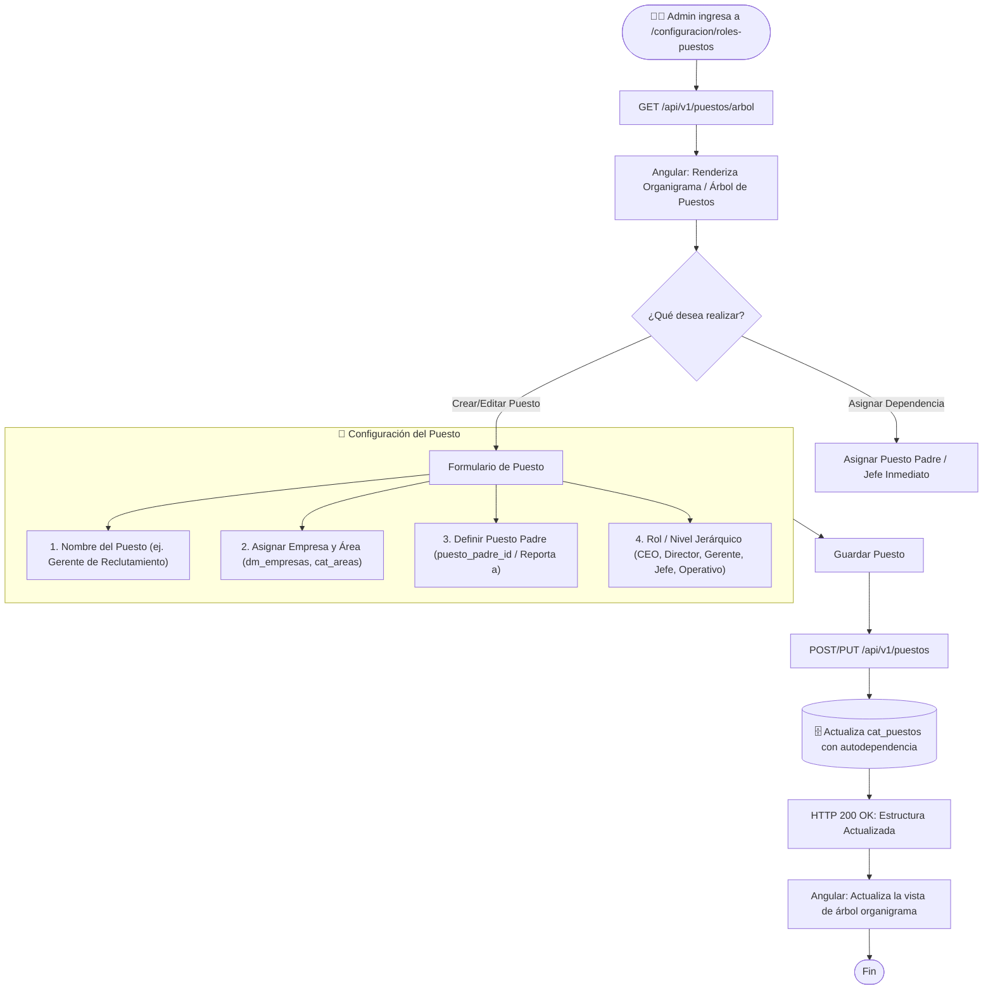

```mermaid
graph TD
    Start([🧑‍💼 Admin ingresa a /configuracion/roles-puestos]) --> FetchPuestos[GET /api/v1/puestos/arbol]
    FetchPuestos --> RenderTree[Angular: Renderiza Organigrama / Árbol de Puestos]

    RenderTree --> Action{¿Qué desea realizar?}

    Action -->|Crear/Editar Puesto| FormPuesto[Formulario de Puesto]
    Action -->|Asignar Dependencia| DragDrop[Asignar Puesto Padre / Jefe Inmediato]

    subgraph ConfigPuesto ["👔 Configuración del Puesto"]
        FormPuesto --> P1["1. Nombre del Puesto (ej. Gerente de Reclutamiento)"]
        FormPuesto --> P2["2. Asignar Empresa y Área (dm_empresas, cat_areas)"]
        FormPuesto --> P3["3. Definir Puesto Padre (puesto_padre_id / Reporta a)"]
        FormPuesto --> P4["4. Rol / Nivel Jerárquico (CEO, Director, Gerente, Jefe, Operativo)"]
    end

    ConfigPuesto --> Save[Guardar Puesto]
    Save --> API_POST["POST/PUT /api/v1/puestos"]
    API_POST --> DB_Save[(🗄️ Actualiza cat_puestos con autodependencia)]
    DB_Save --> HTTP_200[HTTP 200 OK: Estructura Actualizada]
    HTTP_200 --> Redraw[Angular: Actualiza la vista de árbol organigrama]
    Redraw --> End([Fin])
```

