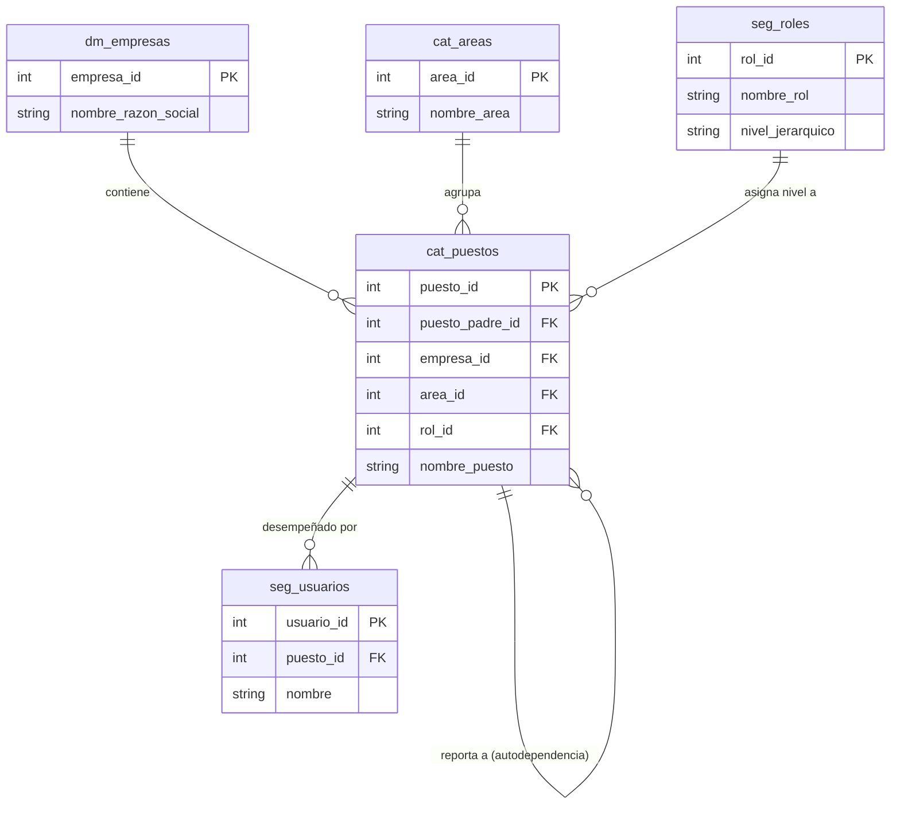

**Descripción de campos de `cat_puestos`:**

- **`puesto_id`**: Identificador único secuencial del puesto.
    
- **`puesto_padre_id`**: Clave foránea autorreferencial (autodependencia) que apunta al `puesto_id` del jefe inmediato/puesto superior. Si es `NULL`, indica que es la cabeza de la jerarquía (ej. CEO).
    
- **`empresa_id`**: Clave foránea que asigna el puesto a una empresa específica (`dm_empresas`).
    
- **`area_id`**: Clave foránea que ubica el puesto dentro de un área funcional (`cat_areas`).
    
- **`rol_id`**: Clave foránea que define el rol y nivel de permisos predeterminado del puesto (`seg_roles`).
    
- **`nombre_puesto`**: Título del puesto (ej. Gerente de Reclutamiento, Coordinador RH, Reclutador Junior).
    
- **`descripcion`**: Detalle de las responsabilidades principales del puesto.
    
- **`estatus`**: Estado de activación del puesto (`TRUE` = Activo, `FALSE` = Inactivo).
    
- **`creado_en`**: Fecha y hora de creación del registro.
    

#### Tabla: `seg_roles` (Actualizada)

Catálogo maestro de roles del sistema, incluyendo el nivel jerárquico asociado dentro de la organización.

|**Nombre del campo**|**Tipo de dato**|**Clave (PK / FK)**|
|---|---|---|
|`rol_id`|`SERIAL` / `INT`|**PK**|
|`nombre_rol`|`VARCHAR(100)`|No|
|`nivel_jerarquico`|`VARCHAR(50)`|No|
|`descripcion`|`TEXT`|No|

**Descripción de campos de `seg_roles`:**

- **`rol_id`**: Identificador único del rol.
    
- **`nombre_rol`**: Nombre identificador del perfil (ej. Administrador, Director, Gerente, Jefe, Operativo).
    
- **`nivel_jerarquico`**: Clasificación del nivel de autoridad (ej. `CEO`, `DIRECTOR`, `GERENTE`, `SUPERVISOR`, `OPERATIVO`).
    
- **`descripcion`**: Detalle del alcance global que posee el rol.

