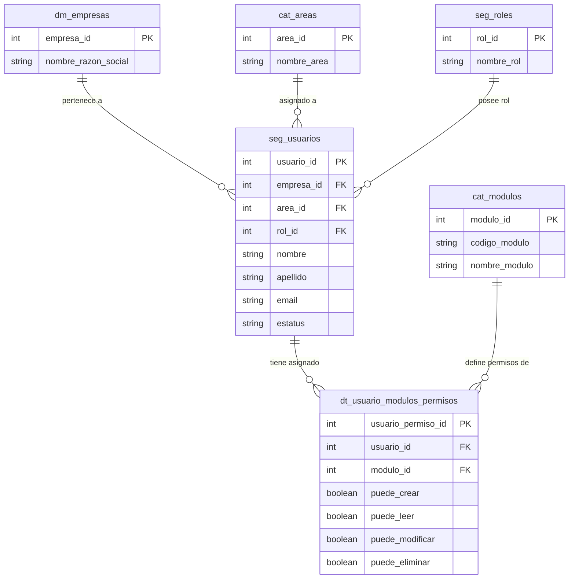

### Tablas de Base de Datos para Usuarios y Permisos

#### Tabla: `cat_areas`

Catálogo maestro para clasificar las áreas organizacionales a las que se asigna un usuario dentro de la empresa.

|**Nombre del campo**|**Tipo de dato**|**Clave (PK / FK)**|
|---|---|---|
|`area_id`|`SERIAL` / `INT`|**PK**|
|`nombre_area`|`VARCHAR(100)`|No|
|`descripcion`|`TEXT`|No|
|`estatus`|`BOOLEAN`|No|

**Descripción de campos de `cat_areas`:**

- **`area_id`**: Identificador único secuencial del área.
    
- **`nombre_area`**: Nombre descriptivo del área (ej. Recursos Humanos, Operaciones, TI, Finanzas).
    
- **`descripcion`**: Detalle adicional sobre la responsabilidad del área.
    
- **`estatus`**: Estado de activación del área (`TRUE` = Activa, `FALSE` = Inactiva).
    

#### Tabla: `seg_usuarios` (Actualizada)

Almacena la información del usuario del sistema, integrando sus datos personales y su estructura organizacional (Empresa y Área).

|**Nombre del campo**|**Tipo de dato**|**Clave (PK / FK)**|
|---|---|---|
|`usuario_id`|`SERIAL` / `INT`|**PK**|
|`empresa_id`|`INT`|**FK** (`dm_empresas`)|
|`area_id`|`INT`|**FK** (`cat_areas`)|
|`rol_id`|`INT`|**FK** (`seg_roles`)|
|`nombre`|`VARCHAR(100)`|No|
|`apellido`|`VARCHAR(100)`|No|
|`email`|`VARCHAR(150)`|No (Único)|
|`password_hash`|`VARCHAR(255)`|No|
|`estatus`|`VARCHAR(50)`|No|
|`creado_en`|`TIMESTAMP`|No|

**Descripción de campos de `seg_usuarios`:**

- **`usuario_id`**: Identificador único secuencial de la cuenta de usuario.
    
- **`empresa_id`**: Clave foránea que vincula al usuario con la empresa correspondiente (`dm_empresas`).
    
- **`area_id`**: Clave foránea que asigna el área funcional del usuario (`cat_areas`).
    
- **`rol_id`**: Clave foránea que especifica el rol global asignado (`seg_roles`).
    
- **`nombre`**: Nombre(s) del usuario.
    
- **`apellido`**: Apellidos del usuario.
    
- **`email`**: Correo electrónico utilizado como credencial de acceso.
    
- **`password_hash`**: Hash seguro de la contraseña.
    
- **`estatus`**: Estado del usuario dentro del sistema (`ACTIVO`, `INACTIVO`, `BLOQUEADO`).
    
- **`creado_en`**: Fecha y hora de creación de la cuenta.
    

#### Tabla: `cat_modulos`

Catálogo del sistema que registra los diferentes módulos o secciones administrables (ej. Requisiciones, Candidatos, Colaboradores).

|**Nombre del campo**|**Tipo de dato**|**Clave (PK / FK)**|
|---|---|---|
|`modulo_id`|`SERIAL` / `INT`|**PK**|
|`codigo_modulo`|`VARCHAR(50)`|No (Único)|
|`nombre_modulo`|`VARCHAR(100)`|No|

**Descripción de campos de `cat_modulos`:**

- **`modulo_id`**: Identificador único del módulo.
    
- **`codigo_modulo`**: Clave técnica utilizada por el backend/frontend para validar acceso (ej. `MOD_REQUISICIONES`, `MOD_CANDIDATOS`, `MOD_COLABORADORES`).
    
- **`nombre_modulo`**: Nombre visible del módulo en la interfaz de usuario.
    

#### Tabla: `dt_usuario_modulos_permisos`

Almacena la matriz detallada de permisos granulares por módulo (CRUD: Crear, Leer, Modificar, Eliminar) asignada específicamente a cada usuario.

|**Nombre del campo**|**Tipo de dato**|**Clave (PK / FK)**|
|---|---|---|
|`usuario_permiso_id`|`SERIAL` / `INT`|**PK**|
|`usuario_id`|`INT`|**FK** (`seg_usuarios`)|
|`modulo_id`|`INT`|**FK** (`cat_modulos`)|
|`puede_crear`|`BOOLEAN`|No|
|`puede_leer`|`BOOLEAN`|No|
|`puede_modificar`|`BOOLEAN`|No|
|`puede_eliminar`|`BOOLEAN`|No|

**Descripción de campos de `dt_usuario_modulos_permisos`:**

- **`usuario_permiso_id`**: Identificador único del registro de permiso asignado.
    
- **`usuario_id`**: Clave foránea que referencia al usuario configurado (`seg_usuarios`).
    
- **`modulo_id`**: Clave foránea que identifica sobre qué módulo aplican estas reglas (`cat_modulos`).
    
- **`puede_crear`**: Permiso para registrar nuevas entidades dentro del módulo (`TRUE`/`FALSE`).
    
- **`puede_leer`**: Permiso para visualizar registros dentro del módulo (`TRUE`/`FALSE`).
    
- **`puede_modificar`**: Permiso para editar registros existentes (`TRUE`/`FALSE`).
    
- **`puede_eliminar`**: Permiso para borrar o dar de baja registros (`TRUE`/`FALSE`).

### Diagrama Entidad-Relación (Mermaid ERD) - Módulo Usuarios y Permisos

