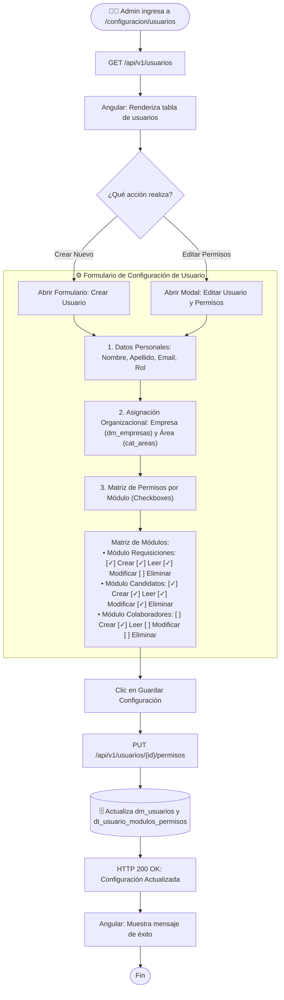

```mermaid
graph TD
    Start([🧑‍💼 Admin ingresa a /configuracion/usuarios]) --> FetchList[GET /api/v1/usuarios]
    FetchList --> RenderTable[Angular: Renderiza tabla de usuarios]

    RenderTable --> Choice{¿Qué acción realiza?}

    Choice -->|Crear Nuevo| FormCreate[Abrir Formulario: Crear Usuario]
    Choice -->|Editar Permisos| FormEdit[Abrir Modal: Editar Usuario y Permisos]

    subgraph FormularioAdmin ["⚙️ Formulario de Configuración de Usuario"]
        FormCreate & FormEdit --> Step1["1. Datos Personales: Nombre, Apellido, Email, Rol"]
        Step1 --> Step2["2. Asignación Organizacional: Empresa (dm_empresas) y Área (cat_areas)"]
        Step2 --> Step3["3. Matriz de Permisos por Módulo (Checkboxes)"]
        
        Step3 --> CheckMatrix["Matriz de Módulos:<br/>• Módulo Requisiciones: [✓] Crear [✓] Leer [✓] Modificar [ ] Eliminar<br/>• Módulo Candidatos: [✓] Crear [✓] Leer [✓] Modificar [✓] Eliminar<br/>• Módulo Colaboradores: [ ] Crear [✓] Leer [ ] Modificar [ ] Eliminar"]
    end

    CheckMatrix --> Save[Clic en Guardar Configuración]
    Save --> API_PUT["PUT /api/v1/usuarios/{id}/permisos"]
    API_PUT --> DB_Save[(🗄️ Actualiza dm_usuarios y dt_usuario_modulos_permisos)]
    DB_Save --> HTTP_200[HTTP 200 OK: Configuración Actualizada]
    HTTP_200 --> Toast[Angular: Muestra mensaje de éxito]
    Toast --> End([Fin])
```

