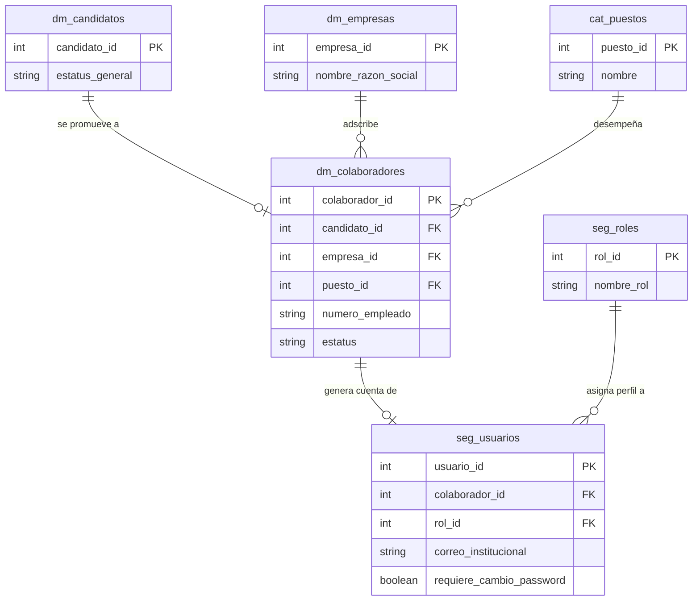

### Diagrama Entidad-Relación (Mermaid ERD) - Módulo Colaboradores y Accesos

### Tablas de Base de Datos para Colaboradores y Accesos

#### Tabla: `dm_colaboradores`

Almacena el expediente del empleado activo promovido desde el flujo de selección.

|**Nombre del campo**|**Tipo de dato**|**Clave (PK / FK)**|
|---|---|---|
|`colaborador_id`|`SERIAL` / `INT`|**PK**|
|`candidato_id`|`INT`|**FK** (`dm_candidatos`)|
|`empresa_id`|`INT`|**FK** (`dm_empresas`)|
|`puesto_id`|`INT`|**FK** (`cat_puestos`)|
|`numero_empleado`|`VARCHAR(50)`|No (Único)|
|`fecha_ingreso`|`DATE`|No|
|`estatus`|`VARCHAR(50)`|No|
|`creado_en`|`TIMESTAMP`|No|

**Descripción de campos de `dm_colaboradores`:**

- **`colaborador_id`**: Identificador único secuencial del colaborador.
    
- **`candidato_id`**: Clave foránea que vincula la ficha del colaborador con su expediente de candidato original (`dm_candidatos`).
    
- **`empresa_id`**: Clave foránea que asigna al colaborador a una empresa del grupo (`dm_empresas`).
    
- **`puesto_id`**: Clave foránea que define el puesto asignado (`cat_puestos`).
    
- **`numero_empleado`**: Código único asignado para nómina o control interno.
    
- **`fecha_ingreso`**: Fecha oficial de contratación o inicio de labores.
    
- **`estatus`**: Estado operativo del empleado (`ACTIVO`, `INACTIVO`, `LICENCIA`, `BAJA`).
    
- **`creado_en`**: Fecha y hora en la que se realizó la promoción a colaborador.
    

#### Tabla: `seg_usuarios`

Almacena las credenciales y el estado de acceso de la cuenta del colaborador al sistema o plataformas institucionales.

|**Nombre del campo**|**Tipo de dato**|**Clave (PK / FK)**|
|---|---|---|
|`usuario_id`|`SERIAL` / `INT`|**PK**|
|`colaborador_id`|`INT`|**FK** (`dm_colaboradores`)|
|`rol_id`|`INT`|**FK** (`seg_roles`)|
|`correo_institucional`|`VARCHAR(150)`|No (Único)|
|`password_hash`|`VARCHAR(255)`|No|
|`requiere_cambio_password`|`BOOLEAN`|No|
|`ultimo_login`|`TIMESTAMP`|No|
|`estatus_cuenta`|`VARCHAR(50)`|No|

**Descripción de campos de `seg_usuarios`:**

- **`usuario_id`**: Identificador único secuencial del usuario del sistema.
    
- **`colaborador_id`**: Clave foránea que relaciona la cuenta de usuario con la persona contratada (`dm_colaboradores`).
    
- **`rol_id`**: Clave foránea que define el nivel de permisos y accesos del usuario dentro del sistema (`seg_roles`).
    
- **`correo_institucional`**: Correo asignado al colaborador para iniciar sesión (ej. `nombre.apellido@empresa.com`).
    
- **`password_hash`**: Contraseña encriptada (hash) generada para la autenticación.
    
- **`requiere_cambio_password`**: Indicador (`TRUE`/`FALSE`) que fuerza al usuario a modificar la contraseña temporal en su primer inicio de sesión.
    
- **`ultimo_login`**: Fecha y hora del acceso más reciente.
    
- **`estatus_cuenta`**: Estado de la cuenta (`PENDIENTE_ONBOARDING`, `ACTIVA`, `BLOQUEADA`).
    

#### Tabla: `seg_roles`

Catálogo de roles de seguridad para controlar las vistas y acciones dentro del ERP.

|**Nombre del campo**|**Tipo de dato**|**Clave (PK / FK)**|
|---|---|---|
|`rol_id`|`SERIAL` / `INT`|**PK**|
|`nombre_rol`|`VARCHAR(50)`|No|
|`descripcion`|`VARCHAR(255)`|No|

**Descripción de campos de `seg_roles`:**

- **`rol_id`**: Identificador único del rol.
    
- **`nombre_rol`**: Nombre del perfil (ej. `COLABORADOR`, `RECLUTADOR`, `ADMINISTRADOR`).
    
- **`descripcion`**: Explicación breve del alcance y nivel de permisos que otorga el rol.

