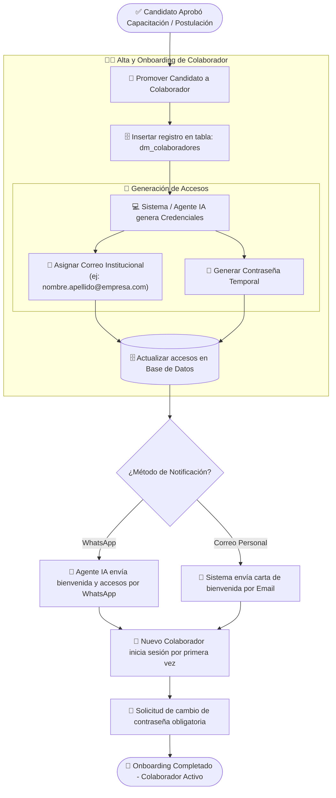

```mermaid
flowchart TD
    %% Inicio desde la fase anterior
    Start([✅ Candidato Aprobó Capacitación / Postulación]) --> Promo[🔄 Promover Candidato a Colaborador]

    %% Transición a Colaboradores
    subgraph Onboarding ["🧑‍💼 Alta y Onboarding de Colaborador"]
        Promo --> CreateColab["🗄️ Insertar registro en tabla: dm_colaboradores"]
        
        %% Asignación de Credenciales
        CreateColab --> GenCreds[💻 Sistema / Agente IA genera Credenciales]
        
        subgraph Credenciales ["🔐 Generación de Accesos"]
            GenCreds --> C1["📧 Asignar Correo Institucional<br/>(ej: nombre.apellido@empresa.com)"]
            GenCreds --> C2["🔑 Generar Contraseña Temporal"]
        end
        
        C1 & C2 --> SaveUser[(🗄️ Actualizar accesos en Base de Datos)]
    end

    %% Notificación al Colaborador
    SaveUser --> Notify{¿Método de Notificación?}
    
    Notify -- WhatsApp --> WA[🤖 Agente IA envía bienvenida y accesos por WhatsApp]
    Notify -- Correo Personal --> Mail[📧 Sistema envía carta de bienvenida por Email]

    %% Primer Inicio de Sesión
    WA & Mail --> Login[👤 Nuevo Colaborador inicia sesión por primera vez]
    Login --> ChangePass[🔐 Solicitud de cambio de contraseña obligatoria]
    ChangePass --> End([🎉 Onboarding Completado - Colaborador Activo])

    %% Enlace opcional para volver al inicio o ir a la nota de Colaboradores en Obsidian
    click End "Modulo_Colaboradores" "Ir al panel de gestión de colaboradores"
```
