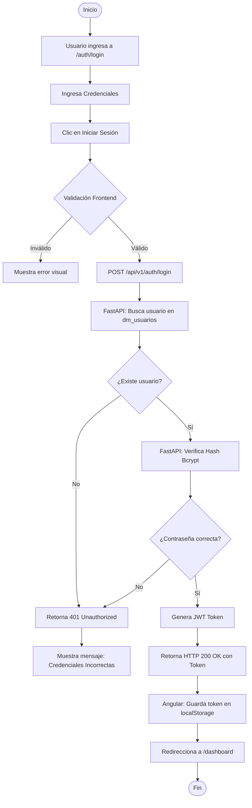

## 1. Diagrama de Flujo del Proceso (Mermaid)

> [!TIP] **Visualización en Obsidian**
> Obsidian renderizará automáticamente este bloque como un diagrama dinámico.

```mermaid
graph TD
    A([Inicio]) --> B[Usuario ingresa a /auth/login]
    B --> C[Ingresa Credenciales]
    C --> D[Clic en Iniciar Sesión]
    
    D --> E{Validación Frontend}
    E -->|Inválido| F[Muestra error visual]
    E -->|Válido| G[POST /api/v1/auth/login]
    
    G --> H[FastAPI: Busca usuario en dm_usuarios]
    
    H --> I{¿Existe usuario?}
    I -->|No| J[Retorna 401 Unauthorized]
    I -->|Sí| K[FastAPI: Verifica Hash Bcrypt]
    
    K --> L{¿Contraseña correcta?}
    L -->|No| J
    
    J --> M[Muestra mensaje: Credenciales Incorrectas]
    
    L -->|Sí| N[Genera JWT Token]
    N --> O[Retorna HTTP 200 OK con Token]
    O --> P[Angular: Guarda token en localStorage]
    P --> Q[Redirecciona a /dashboard]
    Q --> R([Fin])
```

