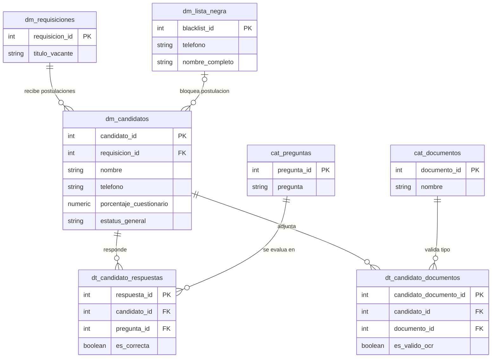

### 1. Tablas de Base de Datos para Postulación y Lista Negra

#### Tabla: `dm_lista_negra`

Almacena el registro de teléfonos o personas bloqueadas para evitar que se postulen a cualquier vacante.

| **Nombre del campo** | **Tipo de dato** | **Clave (PK / FK)** |
| -------------------- | ---------------- | ------------------- |
| `blacklist_id`       | `SERIAL` / `INT` | **PK**              |
| `telefono`           | `VARCHAR(20)`    | No (Único)          |
| `nombre_completo`    | `VARCHAR(200)`   | No                  |
| `motivo`             | `TEXT`           | No                  |
| `creado_en`          | `TIMESTAMP`      | No                  |

**Descripción de campos de `dm_lista_negra`:**

- **`blacklist_id`**: Identificador único secuencial del registro en lista negra.
    
- **`telefono`**: Número telefónico bloqueado para futuras postulaciones.
    
- **`nombre_completo`**: Nombre completo del candidato o persona restringida.
    
- **`motivo`**: Razón o justificación por la cual la persona fue dada de alta en la lista negra.
    
- **`creado_en`**: Fecha y hora en la que se realizó el bloqueo.
    

#### Tabla: `dm_candidatos`

Almacena los datos personales del candidato, el porcentaje global de aprobación y el estado de avance en cada fase.

|**Nombre del campo**|**Tipo de dato**|**Clave (PK / FK)**|
|---|---|---|
|`candidato_id`|`SERIAL` / `INT`|**PK**|
|`requisicion_id`|`INT`|**FK** (`dm_requisiciones`)|
|`nombre`|`VARCHAR(100)`|No|
|`apellido_paterno`|`VARCHAR(100)`|No|
|`apellido_materno`|`VARCHAR(100)`|No|
|`telefono`|`VARCHAR(20)`|No|
|`edad`|`INT`|No|
|`tiene_vehiculo`|`BOOLEAN`|No|
|`anio_vehiculo`|`INT`|No|
|`porcentaje_cuestionario`|`NUMERIC(5,2)`|No|
|`estatus_fase1`|`VARCHAR(20)`|No|
|`estatus_fase2`|`VARCHAR(20)`|No|
|`estatus_fase3`|`VARCHAR(20)`|No|
|`estatus_general`|`VARCHAR(50)`|No|
|`creado_en`|`TIMESTAMP`|No|

**Descripción de campos de `dm_candidatos`:**

- **`candidato_id`**: Identificador único secuencial del candidato.
    
- **`requisicion_id`**: Clave foránea que referencia la vacante a la que se postula (`dm_requisiciones`).
    
- **`nombre`**: Nombre(s) del candidato.
    
- **`apellido_paterno`**: Primer apellido del candidato.
    
- **`apellido_materno`**: Segundo apellido del candidato.
    
- **`telefono`**: Teléfono de contacto registrado para interactuar vía WhatsApp.
    
- **`edad`**: Edad del candidato en años.
    
- **`tiene_vehiculo`**: Indica si cuenta con vehículo propio (`TRUE`/`FALSE`).
    
- **`anio_vehiculo`**: Año o modelo del vehículo (si aplica).
    
- **`porcentaje_cuestionario`**: Calificación obtenida en el cuestionario evaluado por el Agente IA.
    
- **`estatus_fase1`**: Resultado de la evaluación inicial por Cuestionario (`PENDIENTE`, `APROBADO`, `RECHAZADO`).
    
- **`estatus_fase2`**: Resultado de la validación de Documentos (`PENDIENTE`, `APROBADO`, `RECHAZADO`).
    
- **`estatus_fase3`**: Resultado de la Asignación a Capacitación (`PENDIENTE`, `APROBADO`, `RECHAZADO`).
    
- **`estatus_general`**: Estatus global dentro del flujo (`POSTULADO`, `EN_PROCESO`, `CARTERA_TALENTO`, `RECHAZADO`, `APTO`).
    
- **`creado_en`**: Fecha y hora de recepción del formulario de postulación.
    

#### Tabla: `dt_candidato_respuestas`

Registra el detalle de cada una de las respuestas enviadas por el candidato a través de WhatsApp y la calificación que el Agente IA otorgó a cada una.

|**Nombre del campo**|**Tipo de dato**|**Clave (PK / FK)**|
|---|---|---|
|`respuesta_id`|`SERIAL` / `INT`|**PK**|
|`candidato_id`|`INT`|**FK** (`dm_candidatos`)|
|`pregunta_id`|`INT`|**FK** (`cat_preguntas`)|
|`respuesta_candidato`|`TEXT`|No|
|`es_correcta`|`BOOLEAN`|No|

**Descripción de campos de `dt_candidato_respuestas`:**

- **`respuesta_id`**: Identificador único del registro de la respuesta.
    
- **`candidato_id`**: Clave foránea que vincula la respuesta al candidato correspondiente (`dm_candidatos`).
    
- **`pregunta_id`**: Clave foránea que referencia la pregunta evaluada (`cat_preguntas`).
    
- **`respuesta_candidato`**: Texto exacto que el candidato respondió al Agente IA por WhatsApp.
    
- **`es_correcta`**: Resultado de la comparación realizada por la IA contra la respuesta parametrizada (`TRUE`/`FALSE`).
    

#### Tabla: `dt_candidato_documentos`

Almacena las URLs o rutas de los archivos (imágenes/PDFs) cargados por el candidato durante la Fase 2 y el estatus de su validación OCR.

|**Nombre del campo**|**Tipo de dato**|**Clave (PK / FK)**|
|---|---|---|
|`candidato_documento_id`|`SERIAL` / `INT`|**PK**|
|`candidato_id`|`INT`|**FK** (`dm_candidatos`)|
|`documento_id`|`INT`|**FK** (`cat_documentos`)|
|`url_archivo`|`VARCHAR(255)`|No|
|`es_valido_ocr`|`BOOLEAN`|No|
|`subido_en`|`TIMESTAMP`|No|

**Descripción de campos de `dt_candidato_documentos`:**

- **`candidato_documento_id`**: Identificador único del documento cargado por el candidato.
    
- **`candidato_id`**: Clave foránea que vincula el archivo con el candidato (`dm_candidatos`).
    
- **`documento_id`**: Clave foránea que identifica qué tipo de documento se adjuntó (`cat_documentos`).
    
- **`url_archivo`**: Ruta o URL del servidor/storage donde está guardado el archivo enviado por WhatsApp.
    
- **`es_valido_ocr`**: Indica si el documento superó exitosamente la validación del lector de documentos OCR (`TRUE`/`FALSE`).
    
- **`subido_en`**: Fecha y hora en la que se recibió la carga del archivo.

    