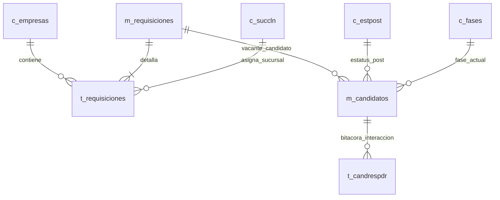

#### **Tabla: m_candidatos**

Registro maestro de candidatos que participan en los procesos de reclutamiento automatizados por los agentes.

|**Nombre del campo**|**Tipo de dato**|**Clave (PK / FK)**|
|---|---|---|
|candidato_id|CHARACTER VARYING(100)|PK|
|telefono|CHARACTER VARYING(20)|No|
|unidad_id|INTEGER|No|
|vacante_id|INTEGER|FK (m_requisiciones)|
|puesto_id|INTEGER|FK (c_puestos)|
|id_fase|INTEGER|FK (c_fases)|
|id_estatus|INTEGER|FK (c_estpost)|
|creado_en|TIMESTAMP WITH TIME ZONE|No|
|actualizado_en|TIMESTAMP WITH TIME ZONE|No|
|nombres|CHARACTER VARYING(100)|No|
|apellido_paterno|CHARACTER VARYING(100)|No|
|apellido_materno|CHARACTER VARYING(100)|Sí|

**Descripción de campos de m_candidatos:**

- **candidato_id**: Identificador único o autogenerado del candidato.
    
- **telefono**: Número de teléfono o WhatsApp de contacto.
    
- **unidad_id**: Identificador de la unidad de negocio.
    
- **vacante_id**: Requisición o vacante a la que postula.
    
- **puesto_id**: Puesto laboral asociado.
    
- **id_fase**: Fase actual en el flujo de selección.
    
- **id_estatus**: Estatus operativo del proceso.
    
- **creado_en**: Fecha de registro inicial.
    
- **actualizado_en**: Fecha de última modificación de estado.
    
- **nombres**: Nombre(s) del candidato.
    
- **apellido_paterno**: Apellido paterno.
    
- **apellido_materno**: Apellido materno.
    

#### **Tabla: t_requisiciones**

Detalle de las requisiciones de empleo, sueldos, horarios, reglas y configuración dinámica de fases en formato JSONB.

|**Nombre del campo**|**Tipo de dato**|**Clave (PK / FK)**|
|---|---|---|
|requisicion_detalle_id|INTEGER|PK|
|requisicion_id|INTEGER|FK (m_requisiciones)|
|sucursal_id|INTEGER|FK (c_succln)|
|tipo_unidad_id|INTEGER|FK (c_tipos_unidad)|
|puesto_id|INTEGER|FK (c_puestos)|
|empresa_id|INTEGER|FK (c_empresas)|
|sueldo_base|CHARACTER VARYING|No|
|horario|CHARACTER VARYING|No|
|dias_ejecucion|CHARACTER VARYING|No|
|modalidad|CHARACTER VARYING|No|
|prioridad|CHARACTER VARYING|No|
|estatus|BOOLEAN|No|
|fecha_creacion|TIMESTAMP WITH TIME ZONE|No|
|configuracion_fases|JSONB|No|
|telefono_reclutador|CHARACTER VARYING|No|

**Descripción de campos de t_requisiciones:**

- **requisicion_detalle_id**: Identificador único del detalle de requisición.
    
- **requisicion_id**: Requisición maestra asociada.
    
- **sucursal_id**: Sucursal donde se solicita la vacante.
    
- **tipo_unidad_id**: Tipo de unidad operativa.
    
- **puesto_id**: Puesto solicitado.
    
- **empresa_id**: Empresa cliente propietaria de la vacante.
    
- **sueldo_base**: Compensación económica ofrecida.
    
- **horario**: Horario laboral estipulado.
    
- **dias_ejecucion**: Días de la semana requeridos.
    
- **modalidad**: Modalidad de trabajo (Presencial, Remota, etc.).
    
- **prioridad**: Nivel de urgencia de la vacante.
    
- **estatus**: Estado activo o inactivo de la requisición.
    
- **fecha_creacion**: Fecha de creación del registro.
    
- **configuracion_fases**: Mapeo en formato JSONB que define cuestionarios, flujos y reglas específicas por fase.
    
- **telefono_reclutador**: Teléfono de contacto del reclutador asignado.
    

#### **Tabla: t_candrespdr**

Bitácora de interacciones, mensajes de entrada de los usuarios y respuestas generadas por el motor de agentes e IA.

|**Nombre del campo**|**Tipo de dato**|**Clave (PK / FK)**|
|---|---|---|
|id_respuesta|INTEGER|PK|
|candidato_id|CHARACTER VARYING|FK (m_candidatos)|
|inputmg|TEXT|No|
|respuesta|TEXT|No|
|id_fase|INTEGER|FK (c_fases)|
|estatusag|INTEGER|No|
|registrado_en|TIMESTAMP WITH TIME ZONE|No|

**Descripción de campos de t_candrespdr:**

- **id_respuesta**: Identificador único de la interacción.
    
- **candidato_id**: Clave foránea del candidato evaluado.
    
- **inputmg**: Mensaje de entrada recibido (del candidato o actor multicanal).
    
- **respuesta**: Respuesta generada por el agente de IA.
    
- **id_fase**: Fase en la que se encontraba la conversación.
    
- **estatusag**: Código de estatus devuelto por el agente (ej. 200).
    
- **registrado_en**: Fecha y hora exacta de la transacción conversacional.
    

#### **Tabla: c_empresas**

Catálogo de empresas cliente y configuración global de flujos de reclutamiento.

|**Nombre del campo**|**Tipo de dato**|**Clave (PK / FK)**|
|---|---|---|
|empresa_id|INTEGER|PK|
|nombre_empresa|CHARACTER VARYING|No|
|razon_social|CHARACTER VARYING|Sí|
|rfc|CHARACTER VARYING|Sí|
|estatus|BOOLEAN|No|
|fecha_creacion|TIMESTAMP WITH TIME ZONE|No|
|config_flujo|JSONB|No|

**Descripción de campos de c_empresas:**

- **empresa_id**: Identificador único de la empresa.
    
- **nombre_empresa**: Nombre comercial.
    
- **razon_social**: Razón social fiscal.
    
- **rfc**: Registro Federal de Contribuyentes.
    
- **estatus**: Indicador de vigencia.
    
- **fecha_creacion**: Fecha de alta en el sistema.
    
- **config_flujo**: Estructura JSONB con el flujo predeterminado de subagentes para la empresa.

