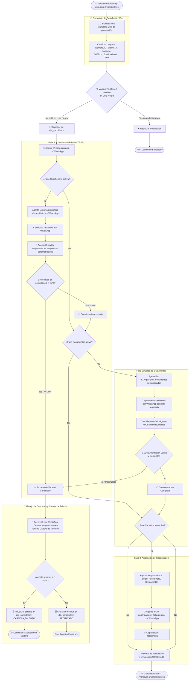

```mermaid
flowchart TD
    Start([📢 Vacante Publicada y Lista para Postulaciones]) --> Post[👤 Candidato llena formulario web de postulación]
    
    %% Registro Inicial
    subgraph Registro ["📝 Formulario de Postulación Web"]
        Post --> RegData["Candidato ingresa: Nombre, A. Paterno, A. Materno,<br/>Teléfono, Edad, Vehículo, Año"]
    end

    %% Validación de Lista Negra
    RegData --> ValBlacklist{🔍 Verificar Teléfono / Nombre<br/>en Lista Negra}
    
    ValBlacklist -- Sí está en Lista Negra --> RejectBlacklist[❌ Rechazar Postulación]
    RejectBlacklist --> EndBlacklist([Fin - Candidato Bloqueado])

    %% Registro de Candidato e Inicio por WhatsApp
    ValBlacklist -- No está en Lista Negra --> SaveCand[🗄️ Registrar en dm_candidatos]
    SaveCand --> BotInit[🤖 Agente IA inicia contacto por WhatsApp]

    %% FASE 1: Cuestionario con Evaluación por Porcentaje (>70%)
    subgraph Fase1 ["Fase 1: Cuestionario Básico / Técnico"]
        BotInit --> CheckQ{¿Fase Cuestionario activa?}
        CheckQ -- No --> CheckDocs
        CheckQ -- Sí --> SendQ[Agente IA envía preguntas al candidato por WhatsApp]
        SendQ --> RecvAns[Candidato responde por WhatsApp]
        RecvAns --> EvalAns["🤖 Agente IA evalúa respuestas vs. respuestas parametrizadas"]
        
        EvalAns --> Score{¿Porcentaje de coincidencia > 70%?}
        Score -- No / <= 70% --> FailTrigger[⚠️ Proceso de Vacante Cancelado]
        Score -- Sí / > 70% --> PassQ[✅ Cuestionario Aprobado]
    end

    %% FASE 2: Carga de Documentos (Submenú Dinámico)
    subgraph Fase2 ["Fase 2: Carga de Documentos"]
        PassQ --> CheckDocs{¿Fase Documentos activa?}
        CheckDocs -- No --> CheckCap
        
        CheckDocs -- Sí --> GetDocsList[Agente lee dt_requisicion_documentos seleccionados]
        GetDocsList --> SubmenuDocs[🤖 Agente envía submenú por WhatsApp con lista requerida]
        SubmenuDocs --> UploadDocs[Candidato envía imágenes / PDFs de documentos]
        UploadDocs --> OCR{🔍 ¿Documentación Válida y Completa?}
        
        OCR -- No / Incompleta --> FailTrigger
        OCR -- Sí --> PassDocs[✅ Documentación Completa]
    end

    %% FASE 3: Asignación de Capacitación
    subgraph Fase3 ["Fase 3: Asignación de Capacitación"]
        PassDocs --> CheckCap{¿Fase Capacitación activa?}
        CheckCap -- No --> Finalize
        
        CheckCap -- Sí --> ReadCap[Agente lee parámetros: Lugar, Fecha/Hora, Responsable]
        ReadCap --> ConfirmCap[🤖 Agente envía confirmación y ficha de cita por WhatsApp]
        ConfirmCap --> PassCap[✅ Capacitación Programada]
    end

    %% LÓGICA DE FALLO Y CARTERA DE TALENTO
    subgraph CarteraTalento ["💼 Manejo de Descartes y Cartera de Talento"]
        FailTrigger --> AskCartera[🤖 Agente IA por WhatsApp: ¿Deseas ser guardado en nuestra Cartera de Talento?]
        AskCartera --> RespCartera{¿Acepta guardar sus datos?}
        
        RespCartera -- Sí --> SaveCartera["🗄️ Actualizar estatus en dm_candidatos: CARTERA_TALENTO"]
        SaveCartera --> EndCartera([✅ Candidato Guardado en Cartera])
        
        RespCartera -- No --> RejectDef["🗄️ Actualizar estatus en dm_candidatos: RECHAZADO"]
        RejectDef --> EndReject([Fin - Registro Finalizado])
    end

    %% Conclusión Exitosa del Proceso
    PassCap --> Finalize[🎉 Proceso de Postulación y Evaluación Completado]
    CheckCap -- No --> Finalize
    
    Finalize --> EndSuccess([✅ Candidato Apto -> Promover a Colaboradores])
```

