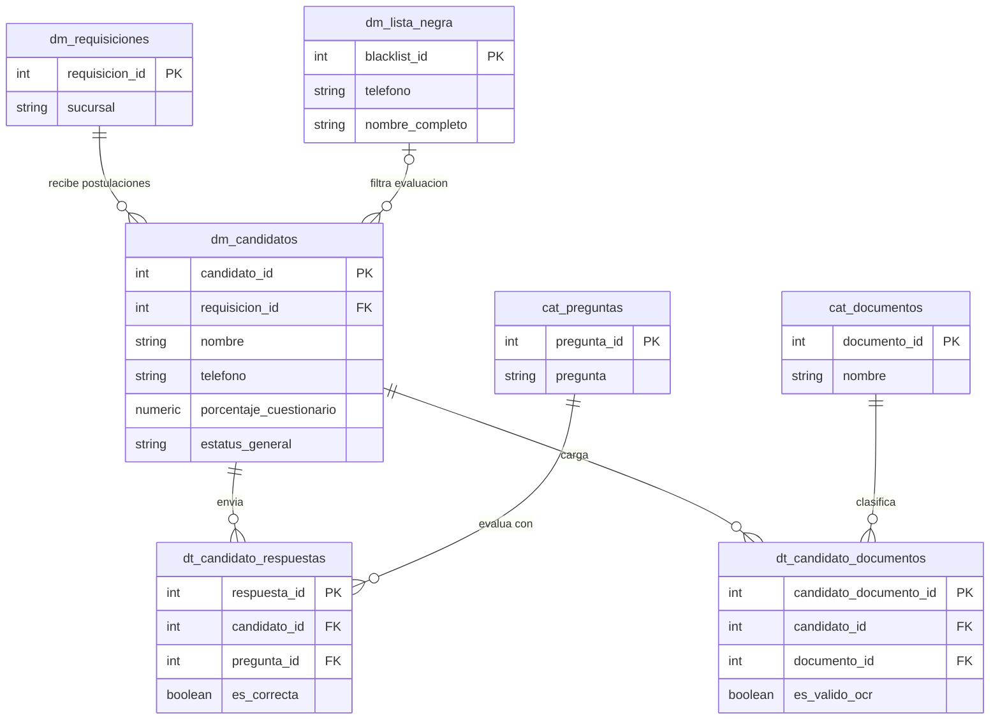

### Tablas de Base de Datos para Reclutamiento

#### Tabla: `dm_candidatos`

Registra la información del postulante, métricas de evaluación de IA y estatus en cada fase del pipeline.

| **Nombre del campo**      | **Tipo de dato** | **Clave (PK / FK)**         |
| ------------------------- | ---------------- | --------------------------- |
| `candidato_id`            | `SERIAL` / `INT` | **PK**                      |
| `requisicion_id`          | `INT`            | **FK** (`dm_requisiciones`) |
| `nombre`                  | `VARCHAR(100)`   | No                          |
| `apellido_paterno`        | `VARCHAR(100)`   | No                          |
| `apellido_materno`        | `VARCHAR(100)`   | No                          |
| `telefono`                | `VARCHAR(20)`    | No                          |
| `edad`                    | `INT`            | No                          |
| `tiene_vehiculo`          | `BOOLEAN`        | No                          |
| `anio_vehiculo`           | `INT`            | No                          |
| `porcentaje_cuestionario` | `NUMERIC(5,2)`   | No                          |
| `estatus_fase1`           | `VARCHAR(20)`    | No                          |
| `estatus_fase2`           | `VARCHAR(20)`    | No                          |
| `estatus_fase3`           | `VARCHAR(20)`    | No                          |
| `estatus_general`         | `VARCHAR(50)`    | No                          |
| `creado_en`               | `TIMESTAMP`      | No                          |

**Descripción de campos de `dm_candidatos`:**

- **`candidato_id`**: Identificador único del candidato.
    
- **`requisicion_id`**: Identificador de la vacante a la cual postula (`dm_requisiciones`).
    
- **`nombre`**: Nombre(s) del candidato.
    
- **`apellido_paterno`**: Primer apellido.
    
- **`apellido_materno`**: Segundo apellido.
    
- **`telefono`**: Teléfono móvil utilizado para la interacción vía WhatsApp con el Agente IA.
    
- **`edad`**: Edad registrada en el formulario.
    
- **`tiene_vehiculo`**: Indica si dispone de vehículo propio (`TRUE`/`FALSE`).
    
- **`anio_vehiculo`**: Año del modelo del vehículo.
    
- **`porcentaje_cuestionario`**: Calificación obtenida en el cuestionario IA (Umbral > 70%).
    
- **`estatus_fase1`**: Resultado del cuestionario (`APROBADO`, `RECHAZADO`, `OMITIDO`).
    
- **`estatus_fase2`**: Resultado de revisión documental OCR (`APROBADO`, `RECHAZADO`, `OMITIDO`).
    
- **`estatus_fase3`**: Resultado de asignación a capacitación (`PROGRAMADO`, `OMITIDO`).
    
- **`estatus_general`**: Estatus global (`EN_PROCESO`, `CARTERA_TALENTO`, `RECHAZADO`, `APTO`).
    
- **`creado_en`**: Timestamp del registro de postulación.
    

#### Tabla: `dt_candidato_respuestas`

Detalle de las respuestas emitidas por el candidato vía WhatsApp y su validación frente al catálogo de preguntas.

|**Nombre del campo**|**Tipo de dato**|**Clave (PK / FK)**|
|---|---|---|
|`respuesta_id`|`SERIAL` / `INT`|**PK**|
|`candidato_id`|`INT`|**FK** (`dm_candidatos`)|
|`pregunta_id`|`INT`|**FK** (`cat_preguntas`)|
|`respuesta_candidato`|`TEXT`|No|
|`es_correcta`|`BOOLEAN`|No|

**Descripción de campos de `dt_candidato_respuestas`:**

- **`respuesta_id`**: Identificador único del registro de respuesta.
    
- **`candidato_id`**: Referencia al candidato evaluado (`dm_candidatos`).
    
- **`pregunta_id`**: Referencia a la pregunta del catálogo (`cat_preguntas`).
    
- **`respuesta_candidato`**: Texto recibido por el bot de WhatsApp.
    
- **`es_correcta`**: Resultado de la evaluación del Agente IA (`TRUE`/`FALSE`).
    

#### Tabla: `dt_candidato_documentos`

Archivos adjuntos enviados por WhatsApp durante la Fase 2 y estado de su procesamiento por OCR.

|**Nombre del campo**|**Tipo de dato**|**Clave (PK / FK)**|
|---|---|---|
|`candidato_documento_id`|`SERIAL` / `INT`|**PK**|
|`candidato_id`|`INT`|**FK** (`dm_candidatos`)|
|`documento_id`|`INT`|**FK** (`cat_documentos`)|
|`url_archivo`|`VARCHAR(255)`|No|
|`es_valido_ocr`|`BOOLEAN`|No|
|`subido_en`|`TIMESTAMP`|No|

**Descripción de campos de `dt_candidato_documentos`:**

- **`candidato_documento_id`**: Identificador del documento del candidato.
    
- **`candidato_id`**: Clave foránea del candidato (`dm_candidatos`).
    
- **`documento_id`**: Tipo de documento según el catálogo (`cat_documentos`).
    
- **`url_archivo`**: Enlace al repositorio digital del archivo.
    
- **`es_valido_ocr`**: Dictamen de lectura automatizada por OCR (`TRUE`/`FALSE`).
    
- **`subido_en`**: Fecha y hora de recepción del archivo.

### Diagrama Entidad-Relación (Mermaid ERD) - Módulo Reclutamiento

