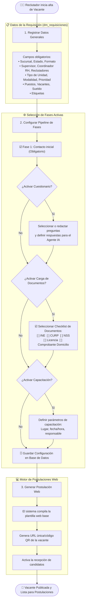

```mermaid
flowchart TD
    Start([🧑‍💼 Reclutador inicia alta de Vacante]) --> DatosGen[1. Registrar Datos Generales]

    %% Datos Generales de Requisición
    subgraph Requisicion ["📋 Datos de la Requisición (dm_requisiciones)"]
        DatosGen --> D1["Campos obligatorios:<br/>• Sucursal, Estado, Formato<br/>• Supervisor, Coordinador RH, Reclutadores<br/>• Tipo de Unidad, Modalidad, Prioridad<br/>• Puestos, Vacantes, Sueldo<br/>• Etiquetas"]
    end

    %% Configuración Dinámica de Fases
    D1 --> ConfigFases[2. Configurar Pipeline de Fases]

    subgraph FasesConfig ["⚙️ Selección de Fases Activas"]
        ConfigFases --> F1["☑️ Fase 1: Contacto inicial (Obligatorio)"]
        F1 --> F2{"¿Activar Cuestionario?"}
        
        F2 -- Sí --> F2_Setup["Seleccionar o redactar preguntas<br/>y definir respuestas para el Agente IA"]
        F2 -- No --> F3{"¿Activar Carga de Documentos?"}
        F2_Setup --> F3
        
        F3 -- Sí --> F3_Setup["☑️ Seleccionar Checklist de Documentos:<br/>[ ] INE  [ ] CURP  [ ] NSS<br/>[ ] Licencia  [ ] Comprobante Domicilio"]
        F3 -- No --> F4{"¿Activar Capacitación?"}
        F3_Setup --> F4
        
        F4 -- Sí --> F4_Setup["Definir parámetros de capacitación:<br/>Lugar, fecha/hora, responsable"]
        F4 -- No --> Save
        F4_Setup --> Save
    end

    %% Generación de Postulación Web
    Save[🗄️ Guardar Configuración en Base de Datos] --> GenPlantilla[3. Generar Postulación Web]
    
    subgraph PlantillaWeb ["💻 Motor de Postulaciones Web"]
        GenPlantilla --> P1[El sistema compila la plantilla web base]
        P1 --> P2[Genera URL única/código QR de la vacante]
        P2 --> P3[Activa la recepción de candidatos]
    end

    P3 --> End([📢 Vacante Publicada y Lista para Postulaciones])

    %% Enlace a la siguiente nota de Obsidian
    click End "Postulacion_Y_Lista_Negra" "Ir al diagrama de Postulación de Candidatos"
```

