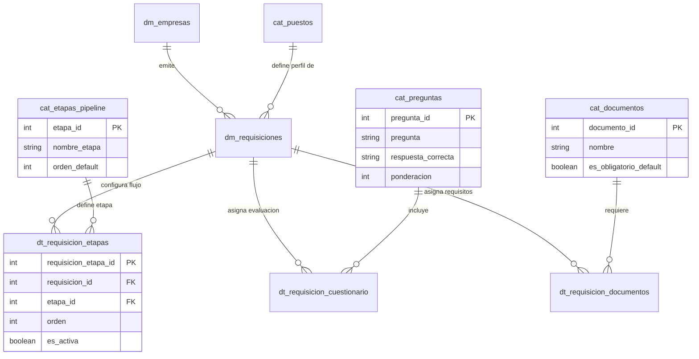

### 1. Tablas Faltantes del Módulo Requisiciones

#### Tabla: `cat_preguntas`

Almacena el banco general de preguntas disponibles para ser asignadas a las vacantes.

|**Nombre del campo**|**Tipo de dato**|**Clave (PK / FK)**|
|---|---|---|
|`pregunta_id`|`SERIAL` / `INT`|**PK**|
|`pregunta`|`TEXT`|No|
|`respuesta_correcta`|`TEXT`|No|
|`ponderacion`|`INT`|No|
|`estatus`|`BOOLEAN`|No|

**Descripción de campos de `cat_preguntas`:**

- **`pregunta_id`**: Identificador único secuencial de la pregunta.
    
- **`pregunta`**: Enunciado completo o reactivo que se le formulará al candidato.
    
- **`respuesta_correcta`**: Criterio de validación o respuesta esperada por el Agente IA para evaluar la postulación.
    
- **`ponderacion`**: Valor en puntos que aporta esta pregunta al puntaje global del candidato.
    
- **`estatus`**: Estado de disponibilidad de la pregunta en el banco maestro (`TRUE` = Activa, `FALSE` = Inactiva).
    

#### Tabla: `cat_documentos`

Almacena el listado de documentos institucionales que se pueden solicitar al candidato.

|**Nombre del campo**|**Tipo de dato**|**Clave (PK / FK)**|
|---|---|---|
|`documento_id`|`SERIAL` / `INT`|**PK**|
|`nombre`|`VARCHAR(100)`|No|
|`es_obligatorio_default`|`BOOLEAN`|No|

**Descripción de campos de `cat_documentos`:**

- **`documento_id`**: Identificador único secuencial del documento.
    
- **`nombre`**: Tipo de archivo solicitado (ej. INE, CURP, Comprobante de Domicilio, Licencia).
    
- **`es_obligatorio_default`**: Define si el documento es requerido obligatoriamente por defecto al crear vacantes.
    

#### Tabla: `cat_etapas_pipeline`

Catálogo maestro de las fases o etapas del proceso de selección.

|**Nombre del campo**|**Tipo de dato**|**Clave (PK / FK)**|
|---|---|---|
|`etapa_id`|`SERIAL` / `INT`|**PK**|
|`nombre_etapa`|`VARCHAR(100)`|No|
|`codigo`|`VARCHAR(50)`|No|
|`orden_default`|`INT`|No|

**Descripción de campos de `cat_etapas_pipeline`:**

- **`etapa_id`**: Identificador único de la etapa.
    
- **`nombre_etapa`**: Nombre descriptivo del paso (ej. Contacto Inicial, Cuestionario IA, Carga de Documentos, Capacitación).
    
- **`codigo`**: Clave técnica de la etapa (ej. `STAGE_CONTACT`, `STAGE_QUIZ`, `STAGE_DOCS`, `STAGE_TRAINING`).
    
- **`orden_default`**: Posición secuencial predefinida en el pipeline general.
    

#### Tabla: `dt_requisicion_etapas`

Configura qué etapas del pipeline están activas específicamente para cada requisición y su secuencia.

|**Nombre del campo**|**Tipo de dato**|**Clave (PK / FK)**|
|---|---|---|
|`requisicion_etapa_id`|`SERIAL` / `INT`|**PK**|
|`requisicion_id`|`INT`|**FK** (`dm_requisiciones`)|
|`etapa_id`|`INT`|**FK** (`cat_etapas_pipeline`)|
|`orden`|`INT`|No|
|`es_activa`|`BOOLEAN`|No|

**Descripción de campos de `dt_requisicion_etapas`:**

- **`requisicion_etapa_id`**: Identificador único del registro de etapa configurada.
    
- **`requisicion_id`**: Vacante a la cual pertenece la regla de flujo (`dm_requisiciones`).
    
- **`etapa_id`**: Referencia a la etapa del catálogo (`cat_etapas_pipeline`).
    
- **`orden`**: Secuencia específica asignada dentro de esta vacante particular.
    
- **`es_activa`**: Indica si la etapa fue habilitada por el reclutador al estructurar la vacante.

### 2. Diagrama de Flujo en Mermaid

Fragmento de código

